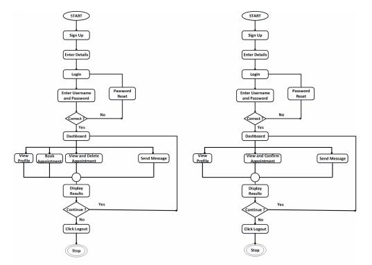

# Hospital Bed Management System (HBMS)

## Overview

The Hospital Bed Management System (HBMS) addresses inefficiencies in managing bed availability, especially during crises such as the COVID-19 pandemic. This application provides a real-time solution for checking and booking hospital beds, streamlining processes for both patients and healthcare providers.

## Motivation

The HBMS aims to improve the efficiency of bed management by:
- Simplifying the process for checking bed availability.
- Streamlining patient registration and bed booking.
- Enhancing hospital resource management.
- Reducing administrative delays and paperwork.

## Flow Chart

## App Features

### 1. User Registration and Login

#### For Patients:
- **Registration**: Patients need to provide:
  - Name
  - Blood Group
  - Age
  - Email Address
  - Phone Number
- **Login**: Patients can log in with their email and password to access the dashboard.

#### For Hospitals:
- **Registration**: Hospitals need to provide:
  - Hospital Name
  - Phone Number
  - Email Address
  - Location Details
  - Number of Available Beds

### 2. User Dashboard

#### For Patients:
- **Hospital Selection**: Browse and select from available hospitals.
- **Hospital Information**: View details such as:
  - Name
  - Location
  - Total and Vacant Beds
- **Location Services**: Utilize the "Locate on Google Maps" feature to find the hospital.
- **Bed Reservation**: Reserve a bed by providing:
  - Name
  - Age
  - Blood Type
  - COVID-19 Report
  - Symptoms

### 3. COVID-19 Tracker

- **Statistics**: View current COVID-19 statistics for specific districts, including:
  - Active Cases
  - Recovered Cases
- **Data Source**: Uses the Volley library and COVID-19 API for real-time data.

### 4. Vaccine Availability

- **Vaccination Centers**: Find nearby vaccination centers by:
  - Entering a Pin Code
  - Selecting a Date

### 5. Reservations

- **My Reservations**:
  - View and manage reservations.
  - Generate a QR Code upon hospital confirmation.
  - Track pending reservations.

### 6. Hospital Dashboard

- **Bed Management**:
  - Update bed statuses:
    - Total
    - Occupied
    - Vacant
- **Reservation Management**:
  - Review and manage pending reservations.

### 7. QR Scanner

- **Verification**: Scan QR Codes to confirm patient reservations and prevent fraudulent bookings.

### 8. Reservation Confirmation

- **Verification**: Hospitals review patient details and COVID-19 reports to:
  - Accept or reject reservations based on bed availability.

### 9. Admin Dashboard

- **Hospital Verification**:
  - Review and verify hospital registration requests.
  - Ensure authenticity to prevent fraudulent requests.
  - Approve valid registrations and add hospitals to the system.

## Installation

1. **Clone the Repository:**
   ```bash
   git clone https://github.com/sriram-17/HBMS.git
